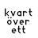

# Swedish word clock

Showing the time as words in Swedish. Eg: kvart över två, halv elva etc

 

## Usage

Just watch it showing the time in Swedish words

## Features

No features at all

## Controls

Taping the screen shows weekday, date and weeknumber

## Requests

johan.dalabacka@gmail.com

## Creator

Johan Dahl
